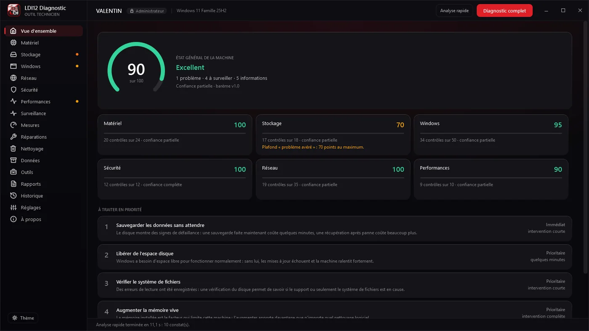
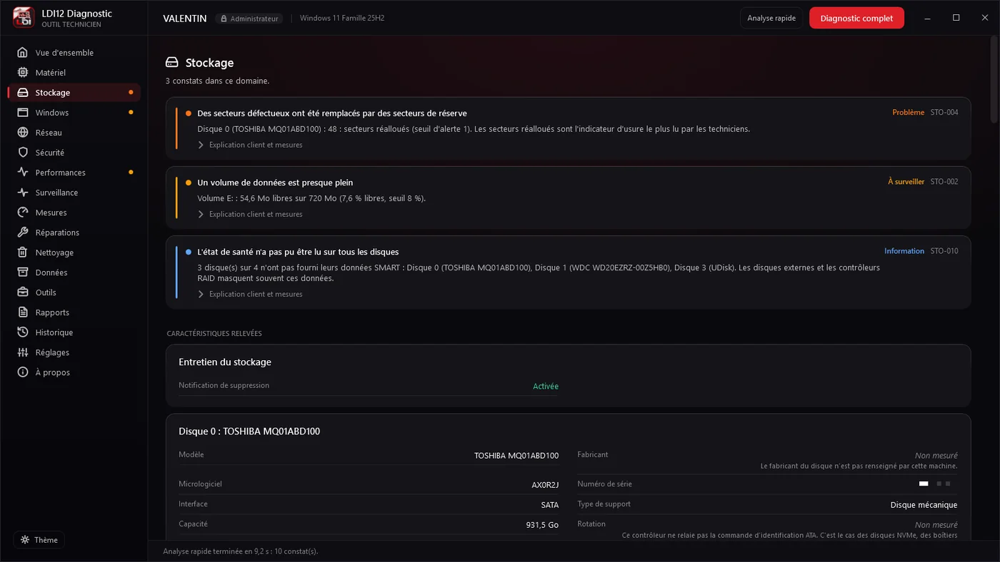
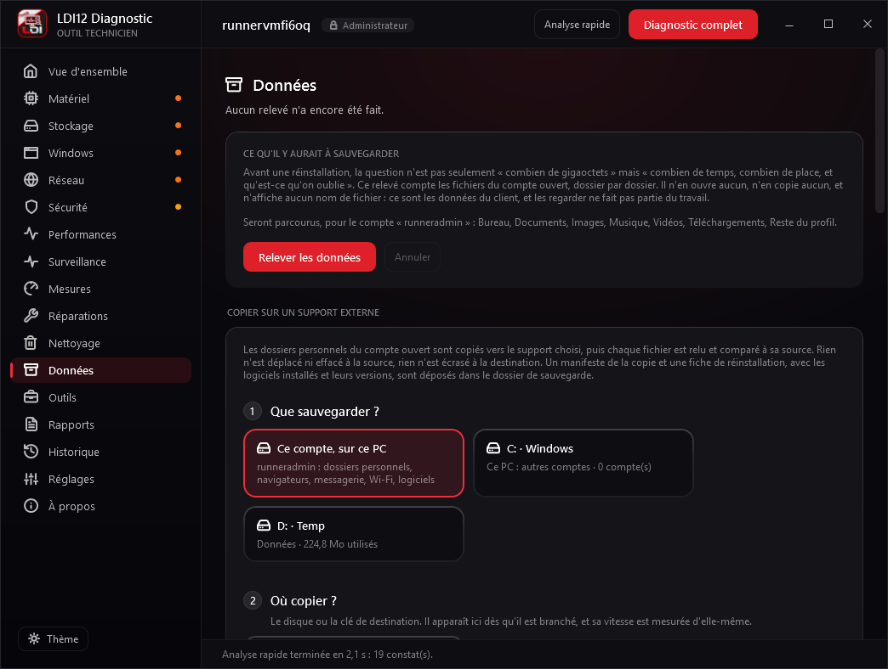
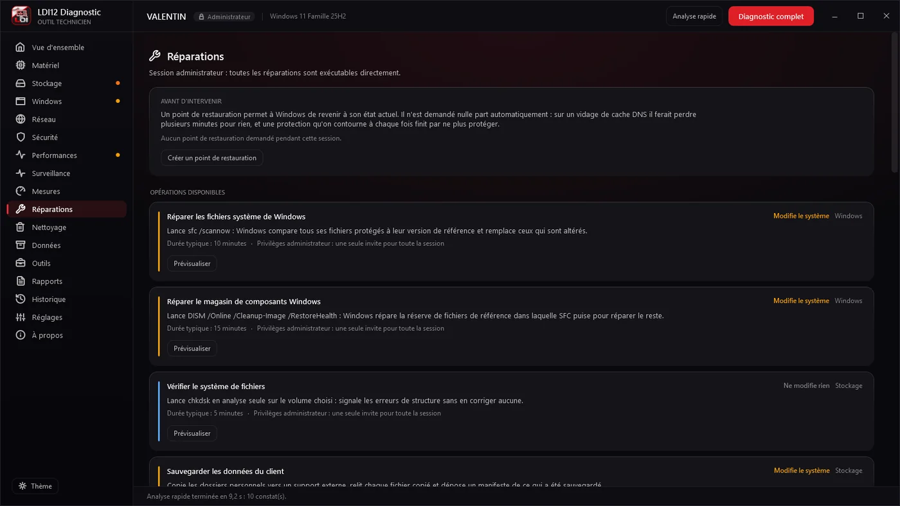
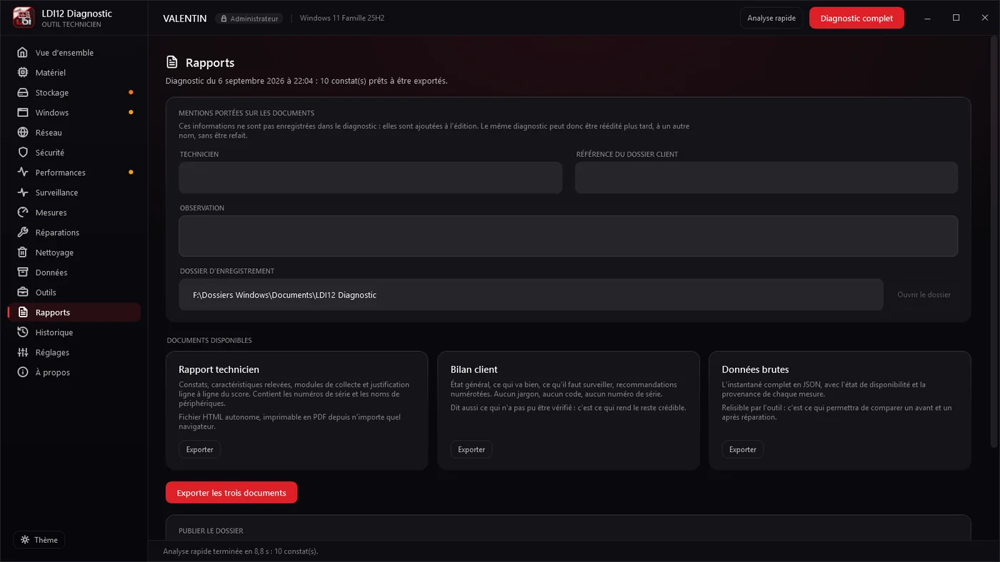

# LDI12 Diagnostic

Un outil de diagnostic et de maintenance pour Windows, écrit pour les interventions de
**Laguiole Dépannage Informatique**, en Aveyron. Un seul fichier à copier sur une clé USB,
qui examine une machine et rend deux documents lisibles : un rapport détaillé pour le
technicien, un bilan sans jargon pour la personne à qui appartient l'ordinateur.

Windows 7 SP1 jusqu'à Windows 11 · x86, x64, ARM64 en émulation · C# et WPF sur
.NET Framework 4.6.2 · exécutable unique de 13,5 Mo · hors ligne.



## Pourquoi celui-ci plutôt qu'un autre

Les outils de diagnostic ne manquent pas. Ce qui manque, c'est un outil qui accepte de dire
qu'il ne sait pas. Une jauge qui passe au rouge sans dire d'où sort le chiffre ne sert à rien
devant un client, et un bouton qui promet d'optimiser sans montrer ce qu'il touche finit par
coûter quelque chose à quelqu'un.

Tout le reste découle de là. Une valeur qui n'a pas pu être lue est affichée absente, avec sa
raison. Un contrôle qui n'a pas pu s'exécuter ne fait pas baisser la note : il sort du calcul,
et la confiance affichée le dit. Chaque point retiré se rattache à une mesure, et le rapport
technicien contient le détail ligne à ligne de ce calcul.

## Ce qu'il relève

Trente-neuf modules parcourent la machine, cent quarante-neuf règles traduisent ce relevé en
constats. L'analyse rapide prend une dizaine de secondes, l'analyse complète deux à quatre
minutes selon l'état du disque.

- **Matériel** : processeur, mémoire, carte mère, écrans, batterie, températures, et les
  erreurs que la machine a elle-même consignées dans ses journaux.
- **Stockage** : santé SMART, espace réel, occupation cachée du dossier Windows, usure des
  SSD, vitesse mesurée plutôt que déduite de la référence commerciale.
- **Windows** : mises à jour, services, démarrage, tâches planifiées, logiciels installés,
  comptes et profils, horloge et synchronisation, points de restauration, fin de support.
- **Réseau** : cartes, adresses, qualité du sans-fil, mandataires, table de routage, fichier
  hosts, résolution de noms, ports en écoute, et le chemin réel d'un paquet jusqu'à la sortie.



## Sauvegarder et restaurer

La moitié des interventions finit par une réinstallation ou un changement de machine. L'écran
**Données** fait le transfert d'un bout à l'autre, en quatre étapes : que sauvegarder, où copier,
ce qui part avec, puis préparer et copier.

- **Chaque fichier est relu sur le support** et comparé à l'original, empreinte SHA-256 à
  l'appui, pas dans le cache de Windows. Il est écrit sous un nom provisoire et ne prend son
  vrai nom qu'une fois vérifié : jamais de fichier à moitié écrit, jamais rien d'écrasé.
- **Un support débranché, plein ou une copie arrêtée** : relancer reprend où la copie s'était
  arrêtée, sans recopier ce qui est déjà vérifié. Un fichier tenu ouvert, une archive Outlook
  par exemple, est récupéré par un cliché instantané de Windows, toujours supprimé ensuite.
- **La durée est annoncée avant de lancer**, d'après une mesure automatique des deux supports.
  Les petits fichiers partent à plusieurs quand le support y gagne, et la machine ne se met pas
  en veille pendant la copie.
- **Le compte ouvert, le disque d'un PC client ou un disque de données.** Un disque qui porte un
  Windows se sauvegarde compte par compte, au nom de la machine lue dans son registre ; un
  disque de données, dossier par dossier. Des dossiers situés n'importe où s'ajoutent à la main.
- **Ce qu'on oublie de noter** : navigateurs (Chrome, Edge, Firefox, Brave, Vivaldi, Opera) et
  leurs mots de passe sur option, Thunderbird et Outlook, Wi-Fi, pilotes au choix, applications
  à réinstaller par winget, imprimantes, lecteurs réseau, clé de Windows, dictionnaire et
  modèles d'Office, fond d'écran, polices.
- **La restauration remet chaque chose à sa place** : pilotes d'abord, puis imprimantes,
  données, lecteurs réseau et applications. Rien n'est supprimé sur la machine, un profil
  remplacé est mis de côté, et la sauvegarde n'est jamais modifiée.
- **Deux documents** sont déposés avec la sauvegarde : la fiche de réinstallation pour le
  technicien, et un rapport imprimable pour le client, ce qui est en sécurité et ce qui ne l'est
  pas, à signer des deux côtés.

Un test sans aucune simulation tourne sous Windows à chaque modification : sauvegarde d'un jeu
de fichiers piégeux, archive tenue ouverte, support arraché puis reprise, restauration sur un
nouveau poste, et chaque fichier comparé à l'original.



## Ce qu'il sait réparer

Vingt-trois opérations, du vidage de cache DNS à la sauvegarde vérifiée des données du client
et à leur restauration. Aucune ne part sur un simple clic : chacune affiche d'abord la commande
exacte qu'elle va lancer, ce qu'elle va modifier, ce qu'elle ne touchera pas, et ce qui sera
perdu au passage. Le nettoyage montre la liste des fichiers avant d'en supprimer un seul.

Cette obligation n'est pas une convention d'écriture, elle est portée par le typage :
`ExecuteAsync` exige l'objet produit par `PreviewAsync`. Il n'existe aucun chemin de code par
lequel une action puisse s'exécuter sans que ce qu'elle allait faire ait d'abord été établi.



## Ce qu'il ne fait pas

Ce n'est pas un antivirus : il constate l'état des protections, il ne cherche rien et ne retire
rien. Il ne promet pas d'accélérer la machine, il montre ce qui la ralentit. Il ne supprime
aucune donnée personnelle de lui-même. Et il n'envoie rien : pas de compte, pas d'inscription,
pas de statistiques d'usage.

Deux connexions existent, et l'une comme l'autre se demandent. La vérification de mise à jour,
proposée au premier lancement et refusable d'un clic : sans réseau, il ne se passe rien et aucun
message n'apparaît. Et le dépôt d'un dossier dans **Klarvi**, l'application de suivi
d'interventions de l'atelier, pour que le rapport se range à côté de la fiche du client sans
recopie. Sans configuration, cette option n'apparaît nulle part. Avec, l'écran affiche d'abord,
ligne par ligne, ce qui quitterait la machine : le nom du poste, la référence du dossier, la
note, une empreinte qui sert à reconnaître le même ordinateur d'une fois sur l'autre, et les
documents tels que le client les reçoit. Ni le diagnostic brut, ni les comptes Windows, ni les
réseaux sans fil relevés sur place.

**Le pilote de capteurs mérite une explication.** Windows ne donne aucun moyen de lire la
température d'un processeur depuis un programme ordinaire, ni chez Intel ni chez AMD. Tous les
outils qui l'affichent chargent un pilote qui parle directement au matériel, et Microsoft classe
plusieurs de ces pilotes comme vulnérables : Defender signale alors le pilote, pas le logiciel
qui l'emploie. Cette lecture est donc désactivée par défaut ici. Tant que l'interrupteur des
réglages n'est pas actionné, aucun pilote n'est chargé.

## Quatre règles qui ne se négocient pas

1. **Une donnée absente dit pourquoi elle l'est.** Tout passe par `Measured<T>`. Afficher
   « 0 °C » quand on n'a pas su mesurer, c'est mentir, et un refus d'accès n'est jamais présenté
   comme une absence.
2. **Une sonde ne peut pas modifier la machine.** `IDiagnosticProbe` lit, `IRepairAction`
   écrit. La séparation tient au typage, pas à la discipline.
3. **Aucun module ne peut faire tomber l'application.** Toute sonde passe par
   `ProbeExecutionPolicy` : délai maximal, capture d'exception, compte rendu. Les modules qui
   peuvent bloquer sur une machine abîmée s'exécutent dans un second processus.
4. **Chaque point perdu a sa ligne de justification.** Le score se recompose exactement à
   partir du grand livre des pénalités, et un test le vérifie sur chaque cas de référence.

## Compiler

```powershell
.\build\build.ps1
```

**MSBuild 17 ou supérieur est obligatoire** : Build Tools pour Visual Studio 2022, charge de
travail « Développement .NET desktop ». `dotnet build` compile les bibliothèques mais pas le
XAML d'une application WPF ciblant .NET Framework. La raison est détaillée dans
[`docs/01-architecture.md`](docs/01-architecture.md) § 1.5.

Les tests tournent avec `vstest.console.exe` sur `tests\LDI12.Tests\bin\Debug\net472\LDI12.Tests.dll`.
Il y en a 1 073.

## Publier l'exécutable qui part sur la clé USB

```powershell
.\build\publish.ps1
```

Produit `artifacts\LDI12-Diagnostic-<version>.exe` et son empreinte SHA-256. Un seul fichier à
copier, rien à installer. La compilation ordinaire laisse l'exécutable entouré de ses cent
treize bibliothèques : c'est ce qu'il faut pour développer, et exactement ce qu'il ne faut pas
emporter chez un client.

Sans certificat de signature, le fichier part non signé et le script le dit : Windows annoncera
« Éditeur inconnu ». Le jour où le certificat existe :

```powershell
.\build\publish.ps1 -CertificateThumbprint <empreinte>
```

L'empreinte SHA-256 est calculée après la signature. Signer modifie le fichier, et une empreinte
prise avant ne correspondrait à rien de ce qui est distribué.

## Essayer sans interface

```powershell
.\src\LDI12.ProbeHost\bin\Debug\net462\LDI12.ProbeHost.exe --dump snapshot.json
```

Collecte, analyse, puis écrit le diagnostic : score par dimension, conclusions, plan d'action
trié et constats détaillés.

| Option | Effet |
|---|---|
| `--quick` | Analyse rapide : lecture pure, aucun outil externe |
| `--analyze <fichier>` | Relit et analyse un diagnostic archivé, sans toucher à la machine |
| `--details` | Affiche le grand livre des pénalités du score |
| `--export-profile` | Exporte le barème pour ajuster seuils et pénalités |
| `--profile <fichier>` | Utilise un barème personnalisé |
| `--report <dossier>` | Exporte les trois documents : technicien, client, JSON |
| `--technician <nom>` | Nom porté en signature des rapports |
| `--client-ref <réf>` | Référence de dossier client portée sur les rapports |
| `--sensors` | Charge le pilote de capteurs matériels, administrateur requis |
| `--no-isolation` | Exécute tout dans ce processus, pour comparer les deux modes |

Le journal technique est dans `%LOCALAPPDATA%\LDI12\Diagnostic\logs\`.



## Contrôler le rendu de l'interface

```powershell
.\src\LDI12.App\bin\Debug\net462\LDI12.Diagnostic.exe --screenshot ui.png --theme light --size 1360x860
```

Lance une analyse, capture la fenêtre en PNG, puis quitte. `--nav <n>` choisit l'écran,
`--scroll <points>` fait défiler avant la capture. Une page prise en haut ne montre jamais ce
qui se passe quand le contenu passe sous les bords, et c'est précisément là que les défauts
d'affichage se voient. Les captures de ce fichier ont été prises ainsi.

L'intégration continue le fait pour chaque écran : un commit dont le message contient
`[captures]` fait capturer les dix-sept écrans en thème sombre et en thème clair, par
`build\captures.ps1`, et les dépose dans [`docs/captures`](docs/captures). Une modification de
l'interface se juge sur l'image, avant et après.

## Structure

| Projet | Rôle |
|---|---|
| `LDI12.Core` | Modèles, abstractions, `Measured<T>`, `SystemSnapshot`. Aucune bibliothèque tierce, aucune référence à un autre projet. |
| `LDI12.Platform` | Détection de Windows, registre de fonctionnalités, P/Invoke, passerelles WMI, registre, processus, journalisation. |
| `LDI12.Collectors` | 39 sondes : matériel, écrans, erreurs signalées, stockage et SMART, Windows, logiciels, tâches planifiées, filet de sécurité, impression, son, stabilité, comptes, heure, ports série, réseau et environnement réseau, sécurité, performances, alimentation, températures. |
| `LDI12.Engine` | Ordonnancement des sondes, 149 règles, corrélations, scoring, plan d'action, comparaison avant et après. |
| `LDI12.Actions` | 23 opérations de réparation, de maintenance, de sauvegarde et de restauration, 23 consoles Windows, journal d'intervention. |
| `LDI12.Updates` | Vérification de mise à jour signée, téléchargement contrôlé par empreinte, remplacement sur place. |
| `LDI12.Reports` | Fiches de caractéristiques, sérialisation JSON, historique local, rapport technicien, bilan client et comparatif en HTML autonome. |
| `LDI12.Publishing.Klarvi` | Dépôt facultatif d'un dossier d'intervention dans Klarvi. Le contrat HTTP est provisoire et confiné à cette classe : le reste du logiciel ne connaît que `IReportPublisher`. |
| `LDI12.ProbeHost` | Exécutable satellite : mode sans interface, hôte des sondes isolées, élévation ciblée. |
| `LDI12.App` | Application WPF sans cadre système : thème sombre et clair, navigation, vue d'ensemble, écrans de domaine, réparations, nettoyage, sauvegarde et restauration, outils, export, réglages. |
| `LDI12.Tests` | xUnit : 1 073 tests, dont des règles d'architecture qui vérifient les cloisonnements décrits ci-dessus, et un aller-retour de sauvegarde sans simulation sous Windows. |

## La conception, écrite

Le dossier complet est dans [`docs/`](docs/README.md) : socle technique, compatibilité de
Windows 7 à 11, modèle de données, moteur de diagnostic, barème, interface, plan
d'implémentation phase par phase et système de mise à jour. Ces documents ne décrivent pas
seulement ce qui a été fait, mais aussi ce qui a été essayé puis abandonné, et pourquoi. C'est
la partie qui sert le plus longtemps.

## Ce qui reste

La signature du code, qui ne dépend plus que d'un certificat. La vérification sur six machines
de générations différentes, Windows 7 SP1 en premier. Les capteurs des cartes graphiques AMD et
le relevé sans fil, faute de matériel pour les éprouver ici.

## Licence

Voir [LICENCE.md](LICENCE.md) : usage et copie libres, modification et revente non. Les
bibliothèques embarquées restent sous leurs propres licences, listées dans
[LICENCES-TIERCES.md](LICENCES-TIERCES.md). Cette liste est tenue dans le code, vérifiée par un
test, et consultable dans le programme sous **Réglages, À propos**.

Le code est publié pour être lu, pas pour être repris. Si quelque chose vous intéresse, écrivez,
c'est plus simple qu'un procès.
